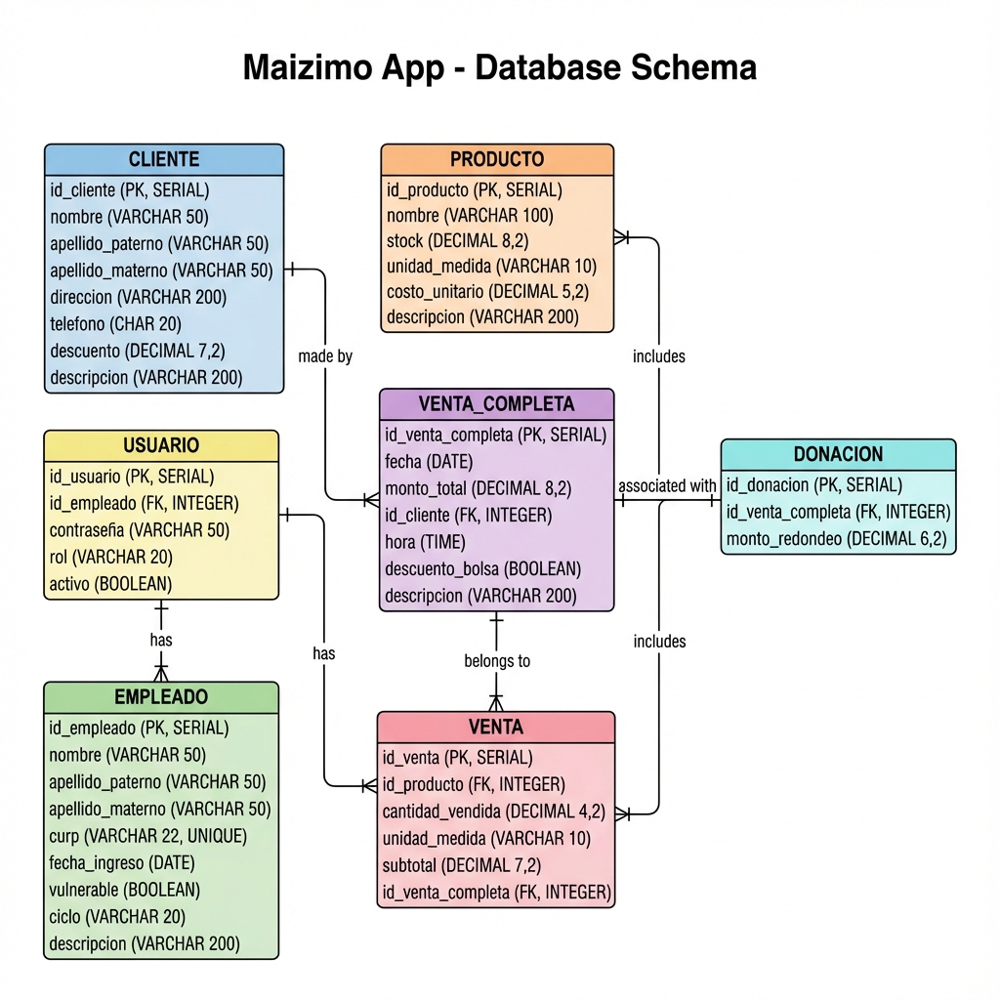

# Documentación Final - Maizimo App (Versión Supabase)

## 📋 Resumen del Proyecto

Esta documentación consolida todo el trabajo realizado para migrar **Maizimo App** de una base de datos MySQL local a **Supabase (PostgreSQL)** en la nube. La aplicación ahora es 100% funcional con persistencia de datos, autenticación y gestión de inventario.

---

## 📊 Schema de Base de Datos

El sistema utiliza 7 tablas relacionales optimizadas para PostgreSQL.

### Diagrama ERD


### Estructura de Tablas

1. **CLIENTE** (Azul)
   - Gestión de clientes mayoristas y frecuentes.
   - `id_cliente`: SERIAL (PK)
   - Datos de contacto y descuentos personalizados.

2. **EMPLEADO** (Verde)
   - Personal de la tortillería.
   - `id_empleado`: SERIAL (PK)
   - `curp`: UNIQUE
   - `ciclo`: Control de estado (espera, proceso, finalizado).

3. **USUARIO** (Amarillo)
   - Credenciales de acceso al sistema.
   - `id_usuario`: SERIAL (PK)
   - `contraseña`: VARCHAR(50) (Texto plano por solicitud).
   - Relación 1:1 con Empleado.

4. **PRODUCTO** (Naranja)
   - Catálogo de productos.
   - `id_producto`: SERIAL (PK)
   - Control de stock y precios unitarios.
   - Unidades: kg, l, ml, pz.

5. **VENTA_COMPLETA** (Morado)
   - Encabezado de ventas (Ticket).
   - `id_venta_completa`: SERIAL (PK)
   - Relaciona Cliente, Fecha, Hora y Monto Total.

6. **VENTA** (Rosa)
   - Detalle de partidas de venta.
   - `id_venta`: SERIAL (PK)
   - Relaciona Producto y Venta Completa.
   - Actualiza automáticamente el stock.

7. **DONACION** (Cyan)
   - Registro de redondeos.
   - `id_donacion`: SERIAL (PK)
   - Vinculado a una Venta Completa.

---

## ⚙️ Configuración y Credenciales

### Archivos de Configuración
- **`.env`**: Contiene las API Keys de Supabase (NO compartir/subir a Git).
- **`config.py`**: Carga las variables de entorno de manera segura.
- **`database.py`**: Gestiona la conexión (Singleton) con Supabase.

### Credenciales de Acceso (Default)
Para probar el sistema inmediatamente:
- **Usuario ID**: `1`
- **Contraseña**: `admin123`

---

## 🚀 Guía de Instalación y Uso

### 1. Requisitos Previos
Asegúrate de tener Python instalado y las dependencias:
```bash
pip install -r requirements.txt
```
*(Dependencias clave: `supabase`, `psycopg2-binary`, `python-dotenv`, `Pillow`)*

### 2. Ejecutar la Aplicación
Para iniciar la interfaz gráfica principal:
```bash
python login_view.py
```

### 3. Scripts de Verificación
El proyecto incluye scripts para probar la conectividad sin abrir la GUI:
- `python test_simple.py`: Prueba básica de conexión y lectura de productos.
- `python test_login.py`: Simula un intento de login en consola.
- `python test_supabase.py`: Suite de pruebas completa (CRUD de todos los modelos).

---

## 📂 Estructura del Código

### Modelos (`/models`)
Capa de acceso a datos (DAO) que abstrae las consultas a Supabase:
- `usuario_model.py`: Autenticación y gestión de usuarios.
- `producto_model.py`: Inventario y búsqueda de productos.
- `venta_model.py`: Lógica compleja de ventas, carritos y transacciones.
- `cliente_model.py`: CRUD de clientes.
- `empleado_model.py`: Gestión de RH.
- `donacion_model.py`: Registro de donaciones.

### Controladores (`/controllers`)
Lógica de negocio que conecta la UI con los Modelos:
- `punto_venta_controller.py`: **Actualizado** para usar `ProductoModel` y `VentaModel`. Carga productos dinámicamente y procesa ventas reales.

---

## 📝 Historial de Cambios (Migración)

1. **Conversión de Schema**: Se transformó el SQL original de MySQL a PostgreSQL, ajustando tipos de datos (`SERIAL` en lugar de `AUTO_INCREMENT`, `VARCHAR` con `CHECK` constraints en lugar de `ENUM`).
2. **Conexión**: Se reemplazó `mysql-connector` por la librería oficial `supabase` y `psycopg2`.
3. **Autenticación**: Se eliminó la validación *dummy* en `login_view.py` y se conectó con la base de datos real.
4. **Correcciones**:
   - Se ajustó el campo contraseña a `VARCHAR(50)`.
   - Se solucionaron problemas de políticas de seguridad (RLS) usando la *Service Role Key* para operaciones de backend.
   - Se corrigieron diagramas para reflejar tipos de datos exactos (Foreign Keys como INTEGER).

---

> **Nota**: Este documento reemplaza a todos los archivos de documentación parciales anteriores (`WALKTHROUGH`, `GUIA_RAPIDA`, etc.) para mantener el proyecto limpio.
